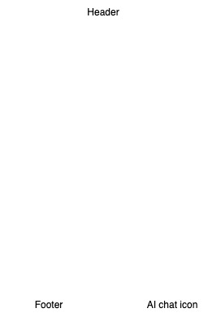
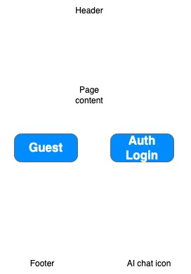
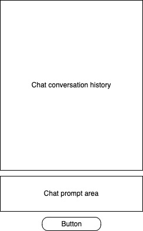

# voyage-project-chingu-map
Chingu Voyage Project - Chingu Member Demographics Map

## Table of Contents

* [Overview](#overview)
* [General Instructions](#general-instructions)
* [Requirements & Specifications](#requirements-and-specifications)
* [Acknowledgements](#acknowledgements)
* [About Chingu](#about-chingu)

## Overview

Hi, Chingus!

Wouldn't it be interesting and fun to learn more about where Chingu's live and a little more about 
their Chingu attributes? Things like their role, tier, country, and timezone.

In this voyage, your team's goal is to design and build a web application, the 
_Chingu Member Demographics Map_, to allow other Chingu's to display this information on a map of
the Earth and to search on a variety of attributes, including role type, role, tier, country, and 
gender. 

Since there are quite a few member attributes you'll also gain experience manipulating larger forms
and filtering data based on many different combinations of fields.

The _Chingu Member Demographics Map_ will help you build new _soft skills_ and refine your current role-based skills. It will also let you build new skills and experience using AI - but, more on this
below.

## General Instructions

This project is designed to be worked on by a team rather than an individual
Chingu. This means you and your team will need to thoroughly read and
understand the requirements and specifications below, **_and_** define and
manage your project following the _Agile Methodology_ defined in the
[Voyage Handbook](https://github.com/chingu-voyages/Handbook/blob/main/docs/guides/voyage/voyage.md#voyage-guide).

As you create this project make sure it meets all of the requirements, but once
you've reached your _Minimum Viable Project (MVP)_ state, start implementing the optional 
features or get creative and extend it in ways we haven't envisioned. In other words, use
the power of teamwork to make it distinctive and unique.

Remember, UI/UX creativity is yours to explore—design an interface that stands
out while ensuring ease of use.

Also, there is no need to purchase any subscriptions or software for this project. 

* We have provided a JSON file containing one entry for each Chingu 
[here](./src/assets/chingu_info.json). This contains **_NO_** 
[personal identifying information (PII)](https://en.wikipedia.org/wiki/Personal_data), nor 
should your application collect or store any information that identifies a specific Chingu.
This will protect the [privacy](https://usercentrics.com/guides/data-privacy/data-privacy-principles/) of individual Chingu's in our organization.
* The 
[Gemini Flash 1.5 free tier](https://ai.google.dev/pricing#1_5flash) is sufficient for the
AI part of the project and there are many 
[web hosting services](https://github.com/chingu-voyages/Handbook/blob/main/docs/resources/techresources/appdeployment.md) 
with free tiers you can use to deploy your app.

We have added a sample React app to the `src` directory of this repo so you can
see an example of how to use AI through an API. To test this you'll need to obtain a Google
Gemini API key and place it in a `.env` file with an attribute name of `VITE_GEMINI_API_KEY`.

## Requirements and Specifications

### What You Need to Do

The following define the minimum requirements and ideas for features you should
implement. But, we've also included stretch goals you should use to enhance
your app once you complete these basic requirements.

This application has quite a few elements. **Make sure you control the scope** so you'll be
able to complete the basic requirements by the end of the Voyage. Remember, you can always
add optional items and enhancements once you've completed the basic app.

#### Structure

* [ ] This can be implemented as a frontend application for Tier 1 & Tier 3. But, Tier 3 teams should implement both a frontend and backend.
* [ ] You may use any languages, tools, or libraries your team agrees on to design and build this app.
* [ ] You may use AI for research. But, you may **_NOT_** use it to create code for your app.

#### Styling

* [ ] Surprise us!!! Use your team's creativity to make this app distinctive.
* [ ] Add a footer containing a link to your team's GitHub repo.
* [ ] Recommend using this resource for [clean CSS](https://israelmitolu.hashnode.dev/writing-cleaner-css-using-bem-methodology).

#### Functionality

* Application Overview

  * [ ] Develop an application that will allow users to display demographic information about 
  Chingu's.
  * [ ] Make sure the application is user-friendly, accessible, and visually appealing.
  * Each page should contain these components:
    * [ ] A _header_ containing the name of the app, the current date, and navigation options
    * [ ] A _footer_ that links to your GitHub repo and a list of who is on the team.
    * [ ] Optionally, a _chat icon_ that will display a popup when clicked to allow the user to ask for help from the AI agent you build into the app.

    

    But, this wireframe doesn't provide many specifics! That's correct! Your
    task is to design your app from the detailed specifications we provide and
    apply your own styling.

* Navigation options

  * [ ] **Home** - displays the landing page when clicked
  * [ ] **Map** - display a geographic map showing where Chingus are located. 
  * [ ] **List** - display a list showing where Chingus are located

* Screens

  * Home Screen

    

    * [ ] Content that advertises the purpose of the app and it's benefits

    **_Optional_** User authentication is not required, but you may add it if you wish.

  * Map Screen

    This screen displays a geographic map showing where Chingu's are located. You may use any
    mapping service & API you wish, but we recommend selecting one that's free to use. Here are
    a few options:
    * [Leaflet](https://leafletjs.com/index.html)
    * [MapBox](https://www.mapbox.com/)
    * [OpenFreeMap](https://openfreemap.org/)
    * [OpenLayers](https://openlayers.org/)
    * [d3.geo](https://d3js.org/d3-geo)
  
    You should implement the following for this screen:
    * [ ] This screen must include a search component that is shared with the List screen.
    * [ ] For each country display a "pin" showing the number of Chingus located there.
    * [ ] Clicking on a "pin" should display a popup, filtered by what the user entered in the
    Search component, of Chingu's in that country. Use your discretion regarding what data
    is to be displayed for each data row.

  * List Screen

    This screen allows users to display a list of attributes for individual Chingu's, filtered 
    by the Search component. This screen must include a search component that is shared with
    the Map screen.

    The data to be displayed in each row should include at least:
    * [ ] Timestamp of when the Chingu applied to join us (`Timestamp`)
    * [ ] Gender
    * [ ] Country code or name
    * [ ] Year the member joined Chingu (from `Timestamp`)
    * [ ] Role type
    * [ ] Role
    * [ ] Solo Project Tier
    * [ ] Voyage Tier
    * [ ] Voyage   

  * Common Search Component

    This component allows users to filter the display of results based on any or all of the
    following. It must be shared between the Map and List screens. 
    * [ ] Gender
    * [ ] Country code or name
    * [ ] Year the member joined Chingu (from `Timestamp`)
    * [ ] Role type
    * [ ] Role
    * [ ] Solo Project Tier
    * [ ] Voyage Tier
    * [ ] Voyage

  * [ ] The form should include a button to submit the filter request.
  * [ ] The form should include a button to clear the contents of the filter fields. 
  * [ ] The user must be allowed to update any filter fields between submissions.
  * [ ] When the user clicks the submit button the displayed results should be updated 
  based on the filter criteria.
  * [ ] It is valid for the user to enter any combination of filter fields or none at all.
  * When the clear button is clicked in the filter form 
    * [ ] Map screen: Results from a prior query should be refreshed to include all entries.
    * [ ] List screen: Results from a prior query should be refreshed to include the first page of 
    data.  

* Optional - AI Chat Icon

  * [ ] When clicked, display a popup dialog to allow the user to chat with the AI about this application. This conversation is intended to replace traditional documentation. Instead, it let's the user ask questions like "How can I filter results?" and "How do I specify which repo is to be used?".
  * [ ] The popup dialog has three components to support this:

      

    - A conversion display area that contains a infinite scroll containing the questions the user asked followed by the response from the AI.
    - An input field where the user may enter their question
    - A button the user may click to submit their question.

    To implement this requirement you'll need to use the
    [Google Gemini API](https://ai.google.dev/api?lang=node) to create a context for your
    application and to allow the users to ask questions using it. You can find and example
    of how to do this in the `src` directory of this repo. 

    This is just an example, for your app you will need to create context information about
    it Google Gemini will use to answer your users questions.

* Validation and Error Handling

  * [ ] Display an error message for invalid inputs (e.g. an undefined search attribute).
  * [ ] The user must be informed about errors at the time they are detected.
  * [ ] Error messages should be cleared when they are corrected.

* User Interface and Experience (UI/UX)

  * [ ] In general, you will find these [UI design principles](https://www.justinmind.com/ui-design/principles) helpful.
  * [ ] If your team doesn't include a dedicated UI/UX Designer you will [find
these tips](https://github.com/chingu-voyages/Handbook/blob/main/docs/resources/techresources/uiux.md)
helpful.

### Stretch Goals (Not Required)

Once you complete the basic application you may enhance it with any of the
following _optional_ stretch goals. Make sure that any of these you choose
match the capabilities of your tier.

* [ ] Add an AI chatbot users can utilize to get help using the application.
Although this is an optional requirement, we strongly suggest Tier 2 & Tier 3
teams attempt this. 

* [ ] Enhance results filtering to allow the user to specify additional constraints
on the results to be displayed. 

* [ ] Allow the user to sort results by clicking on column headings or icons 
adjacent to them.

* [ ] Implement full-stack application that makes the calls to the Gemini API
via a BE route. Frontend and backend are required.

* [ ] More advanced teams may also wish to load the JSON file we've provided into a
database and implement API routes to more efficiently and quickly retrieve data than
by reading the JSON file alone.

* [ ] Authenticate users via Google or GitHub to increase the security of your app.
  * [Github Authentication](https://www.npmjs.com/package/oauth-client-github)
  * [Google Authentication](https://developers.google.com/identity/gsi/web/guides/get-google-api-clientid)
  A detailed guide on how to obtain an API key and perform Google Authentication.

* [ ] Add a Dashboard page, including the Search component, to display demographics using different 
types of graphs.

* [ ] Surprise us with any features you would like to add to this app! Brainstorm
with your teammates to see what you can come up with.

## Acceptance Criteria

* [ ] You should include a good readme in your project repo.
* [ ] Add acceptance criteria to your readme for any stretch goals you choose
to implement.
* [ ] Users can enter data into the input form, submit it, and formatted
results will be displayed.
* [ ] Error messages are displayed at the time an error is detected. These
should be clear and provide advice for how to correct the error
* [ ] The UI provides clear feedback for invalid inputs.
* [ ] The UI should be responsive
* [ ] The results returned from Gemini are displayed in a clear and readable
fashion.

## Acknowledgements

We would like to express our profound gratitude to the global developer
community, whose collaborative spirit and shared knowledge continually
motivate and enrich our endeavors. Together, we achieve extraordinary
milestones. Thank you.

## About Chingu

If you aren't yet a member of Chingu we invite you to [join us](https://chingu.io).
We help our members transform what they've learned in courses & tutorials into the
practical experience employers need and want. The experience that helps to set you
apart from other applicants for the same jobs.
